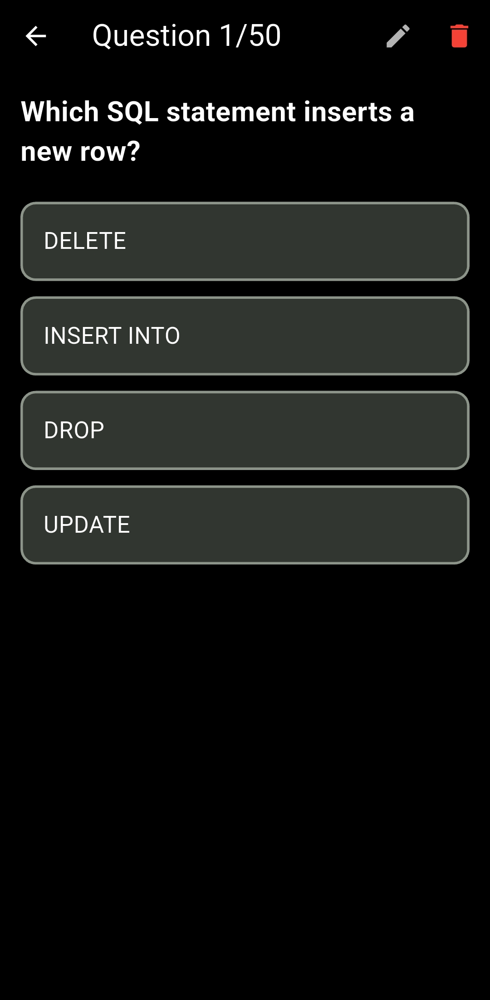

# Study Buddy 🎓
### *Your Ultimate Companion for Government IT Officer Exams*

**Study Buddy** is a powerful, offline-first mobile application designed to help candidates ace their IT Officer exams. It combines smart scheduling, daily quizzes, and syllabus management into one sleek, distraction-free experience.

---

## ✨ Key Features

-   **🔥 Smart Streak Tracking**: Visual streak indicators (Active, At Risk, Expired) to keep you motivated daily.
-   **📅 Flexible Scheduling**:
    -   **Weekly Plan**: Set exact study times for specific days.
    -   **Frequency Mode**: Get reminders every X minutes (e.g., every 45 mins) to build a rhythm.
    -   **Quiet Hours**: Intelligent silence during your sleep or work hours.
-   **🧠 Daily Quizzes**: Practice with questions stored locally—no internet required.
-   **📂 Syllabus Manager**: Built-in PDF viewer to keep your study materials organized and accessible.
-   **🤖 AI Integration**: (Optional) Generate new questions on the fly using AI providers.
-   **🌙 Dark Mode**: Eye-friendly interface for late-night study sessions.

---

## 📱 App Screenshots

|        Dashboard & Streaks        |         Weekly Schedule         |      Quiz Interface     |
| :-------------------------------: | :-----------------------------: | :---------------------: |
|  |  |  |

---

## � User Guide: How to Use Study Buddy

Welcome to Study Buddy! Here is how to navigate and master the app.

### 1. The Dashboard 🏠
Your central hub for progress.
-   **Streak Icons**:
    -   🔥 **Orange Fire**: Streak Active! You've studied today.
    -   ⏳ **Amber Hourglass**: Warning! You haven't studied yet today.
    -   🎯 **Grey Target**: Streak Expired. Start a new streak today!
-   **Daily Progress**: Shows how many questions you've answered today vs your daily goal.

### 2. Scheduling Your Study 📅
Study Buddy offers two powerful ways to manage your time. Go to **Settings** or the **Schedule Tab** to configure.

#### Option A: Frequency Mode (Best for Rhythm)
Great if you want consistent reminders throughout the day.
1.  Go to **Settings**.
2.  Enable **"Frequency Notifications"**.
3.  Select an interval (e.g., **60 minutes**).
4.  **Quiet Hours**: Set a "Start" and "End" time (e.g., 10 PM to 7 AM) to mute notifications while you sleep.

#### Option B: Weekly Schedule (Best for Routine)
Great if you study at specific times (e.g., every Monday at 9 AM).
1.  Go to the **Schedule Tab**.
2.  Tap on a day (e.g., **Monday**).
3.  Tap **"+"** to add a time (e.g., 09:00).
4.  Repeat for other days.
5.  *Tip*: Use the **Copy** button to quickly copy Monday's schedule to other days!

### 3. Taking Quizzes 📝
1.  Tap **"Start Quiz"** on the Dashboard.
2.  Select a topic or choose "Random Mix".
3.  Answer questions. You get instant feedback (Green/Red).
4.  Review your score at the end.

### 4. Syllabus & PDFs 📚
1.  Go to the **Syllabus Tab**.
2.  Tap **"Open PDF"** to view the official syllabus.
3.  The app remembers your page number, so you can pick up right where you left off.

---

## �🛠 Tech Stack

Built with ❤️ using **Flutter**.

| Category | Technology |
| :--- | :--- |
| **Framework** | Flutter (Dart) |
| **State Management** | Provider |
| **Local Database** | Hive (NoSQL) |
| **Background Tasks** | Android Alarm Manager Plus |
| **Notifications** | Flutter Local Notifications |
| **PDF Engine** | PDFx |

---

## 🏗 Architecture

Study Buddy is engineered for **reliability** and **performance**:
-   **Offline-First**: All data (questions, settings, progress) is stored locally using Hive, ensuring the app works perfectly without an internet connection.
-   **Robust Background Services**: We utilize native Android alarms (`AlarmManager`) to guarantee notification delivery, even if the app is completely closed or the device is restarted.
-   **Clean Codebase**: Structured with a clear separation of Data, Domain, and Presentation layers for easy scalability.

---

## 🚀 Download & Demo

This application is currently private, and the APK is not available for public distribution.
Access, downloads, or redistribution are not permitted at this time.

---

## 🔮 Future Roadmap

-   [ ] **Cloud Sync**: Backup your progress across devices.
-   [ ] **Community Challenges**: Compete with other candidates.
-   [ ] **Advanced Analytics**: Detailed charts of your weak and strong topics.

---

## 🤝 License & Contribution

© All rights reserved by [Gokul Subedi](https://github.com/mesafal). This project is closed-source.

Got ideas, feedback, or want to collaborate? I’m open to meaningful contributions and discussions.  
Reach out via [GitHub](https://github.com/meSafal) or email at [subedigokul119@gmail.com](mailto:subedigokul119@gmail.com).

---

> Happy Coding 🙂🙂🙂  
> Contact me if you have any queries.

📘 This repository and its documentation were prepared and maintained by <a href="https://github.com/MeSafal/" target="_blank"><u><strong>Gokul Subedi</strong></u></a>. For the latest updates and related projects, visit <a href="https://github.com/MeSafal" target="_blank">github.com/MeSafal</a>.
